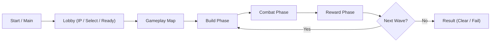

# TenTenTown – Co-op Tower Defense (Dedicated Server / 4 Players)

## 프로젝트 소개

**TenTenTown**은 **4인이 협력**하여 구조물을 설치·업그레이드하고, 웨이브 단위로 몰려오는 적을 막아 **코어(Core)** 를 지키는 **협동형 타워 디펜스** 게임입니다.

* **전용 서버(Dedicated Server)** 환경을 기준으로 설계/구현되었습니다.
* 게임은 **로비 → 인게임 → 빌드(Build) → 전투(Combat) → 보상/정비(Reward)** 의 반복 루프로 진행됩니다.
* **코어가 파괴되면 즉시 실패**, 모든 웨이브를 생존하면 **클리어**합니다.

---

## 개발 환경

* **Engine** : Unreal Engine 5.x
* **IDE** : JetBrains Rider(권장) / Visual Studio 2022
* **Version Control** : Git + GitHub (브랜치 전략 기반 협업)
* **Language/Tech** : C++ / Replication / UMG / **MVVM** / **GAS(Gameplay Ability System)**
* **Server / Hosting** : Dedicated Server 빌드 기반(패키징/배포 환경 확장 가능)

---

## 게임 개요

| 구분    | 내용                                            |
| ----- | --------------------------------------------- |
| 장르    | 협동형 타워 디펜스 (Co-op Defense)                    |
| 인원    | 1~4인                                          |
| 목표    | 코어 방어 / 모든 웨이브 생존 시 클리어                       |
| 핵심 루프 | Build(설치/업글) → Combat(웨이브 방어) → Reward(정비/보상) |
| 전투    | 캐릭터 협동 전투 + 구조물 자동 공격/트랩                      |
| 성장    | 웨이브 보상(재화/경험치/아이템) 기반 강화                      |

---

## 시연 영상

<div align="center">
  <a href="https://youtu.be/iDdOEy3eLyI" target="_blank">
    
  </a>
  <br />
  <sub>이미지를 클릭하면 YouTube로 이동합니다.</sub>
</div>


---

## 게임 규칙

### 공통

* 코어가 파괴되면 **즉시 게임 오버**
* 웨이브를 모두 막으면 **게임 클리어**
* 웨이브는 **전투 단계**에서 진행되며, 종료 조건을 만족하면 **보상/정비 단계**로 이동합니다.

### 빌드(Build) 단계

* 제한 시간 동안 **구조물 설치/업그레이드**가 가능합니다.
* 설치/업그레이드는 **재화(Gold/Resource)** 를 소모합니다.
* (기획 기준) 팀 총량/개인 제한이 존재하며, 구조물 유형별 제한을 둡니다.

### 전투(Combat) 단계

* 웨이브가 시작되면 몬스터가 스폰되고, 플레이어는 캐릭터 전투 + 구조물로 방어합니다.
* 몬스터 처치/웨이브 목표 달성 시 전투가 종료되고 Reward 단계로 넘어갑니다.

### 보상/정비(Reward) 단계

* 웨이브 클리어 보상으로 **재화/경험치/아이템**을 획득합니다.
* 상점 이용 및 다음 웨이브 준비가 가능합니다.

---

## 게임 플로우


# 팀 역할

| 이름      | 담당                                       |
| ------- | ---------------------------------------- |
| **이서호** | GameMode / Network(서버 흐름, 페이즈/전환, 전반 통합) |
| **박진권** | Enemy/AI – 웨이브 스폰/전투 진행                  |
| **김동권** | Enemy/AI – 보스/엘리트, 난이도/패턴                |
| **정윤호** | Character – Fighter/Archer, 공통 구조 공동 구축  |
| **이정민** | Character – Mage/Priest, 공통 구조 공동 구축     |
| **김선우** | 구조물 + 아이템 시스템                            |
| **심효종** | UI/HUD/인벤토리(MVVM, PCC 흐름)                |
| **황순호** | 맵 디자인(레벨 구성/동선/밸런스)                      |

---


# 주요 기능

## 1) GameMode / GameState 기반 페이즈(Phase) 흐름

TenTenTown은 서버 권한을 기준으로 게임 흐름을 제어합니다.

* **서버(GameMode)**

  * 페이즈 시작/종료, 웨이브 진행, 보상 지급, 클리어/실패 판정
* **클라이언트(GameState 또는 태그/복제 값)**

  * 현재 페이즈 상태, 남은 시간, 웨이브 정보 등을 받아 UI와 입력을 동기화

> **코드 기반 연결 포인트(현재 구현 흐름)**
> * `UPlayPCComponent`는 `State_Mode_Gameplay` 태그를 구독하여 HUD를 오픈합니다.
> * `ULobbyPCComponent`는 `State_Mode_Lobby` 및 로비 UI 관련 태그를 구독하여 로비 UI를 오픈/숨김 처리합니다.

---

## 2) 로비(Lobby) UI / 캐릭터 선택 / 맵 선택 (태그 구독 기반)

로비에서는 **ASC(Gameplay Ability System Component)** 의 태그 변화로 UI가 열리고 닫히는 구조입니다.

### 로비 PCC 컴포넌트 (`ULobbyPCComponent`)

* `ReBeginPlay()`에서 **ASC가 준비될 때까지 재시도**하여 태그 구독을 안정적으로 연결합니다.
* 아래 태그를 구독하여 UI 상태를 제어합니다.

  * `State_Mode_Lobby` : 로비 진입/이탈에 따른 루트 UI 오픈/클로즈
  * `UI_State_CharacterSelectOpen` : 캐릭터 선택 UI 표시/숨김
  * `UI_State_MapSelectOpen` : 맵 선택 UI 표시/숨김
  * `State_Role_Host` : 호스트 여부 표시/버튼 활성화 등

### 위젯 구성(코드 기준 생성)

* `ULobbyWidget` : 로비 루트 UI
* `UCharSellectWidget` : 캐릭터 선택 UI
* `UMapSelectWidget` : 맵 선택 UI
* `ULobbyViewModel` : GameState/PlayerController 기반 초기화 후 위젯에 주입

### 입력 모드 전환

* 캐릭터 선택/맵 선택 UI가 열리면 `UIOnly` + 마우스 커서 ON
* UI가 닫히면 `GameOnly` + 커서 OFF

---

## 3) 인게임 HUD / 상점 UI (PCC + MVVM)

인게임 UI는 `UPlayPCComponent`가 담당하며, ViewModel을 기반으로 HUD를 구성합니다.

### `UPlayPCComponent` 초기화 흐름

1. BeginPlay에서 ViewModel 생성

   * `UPlayerStatusViewModel`, `UGameStatusViewModel`, `UPartyManagerViewModel`,
     `UQuickSlotManagerViewModel`, `UTradeViewModel`, `USkillCoolTimeViewModel`
2. `FindSetASC()`로 ASC를 찾고, `State_Mode_Gameplay` 태그 구독
3. 태그 활성화 시 `OpenHUDUI()` 수행

   * ASC 및 `UAS_CharacterBase` AttributeSet이 준비됐는지 확인 후 HUD 오픈
   * 준비가 안 됐으면 타이머로 재시도하여 안정적으로 오픈

### HUD/상점 위젯 생성(코드 기준)

* `UPlayWidget` : 인게임 HUD
* `UTradeMainWidget` : 상점(Trade) UI

### 상점 오픈/클로즈: 태그 기반

* `UI_State_ShopOpen` 태그 구독
* 태그 활성화 → `TradeMainWidget` Visible, 입력 모드 UIOnly
* 태그 비활성 → Hidden, 입력 모드 GameOnly

---

## 4) 상점 오픈 효과(서버 판정) – GameplayEffect 적용

상점 UI는 “클라에서 단순 표시”가 아니라, **서버에서 GE(게임플레이 이펙트)** 를 적용/제거하는 방식으로 상태를 명확히 합니다.

* `UPlayPCComponent::Server_ControllTradeOpenEffect(bool OnOff)`

  * GameMode의 `ShopOpenGEClass`를 사용
  * OnOff == true → GE Spec 생성 후 적용
  * OnOff == false → 해당 소스 이펙트 제거

이 구조는 “상점 오픈 상태”를 네트워크에서 일관되게 유지하기 용이하며, UI 상태/입력 제어를 GAS 태그로 통합할 수 있습니다.

---

## 5) 인벤토리 / 골드 / 퀵슬롯 (서버 복제 + OnRep 델리게이트)

### 인벤토리 PCC 컴포넌트 (`UInventoryPCComponent`)

* `SetIsReplicatedByDefault(true)`로 컴포넌트 복제 활성화
* 서버에서 `InitFixedSlots()`로 기본 슬롯 구성
* 복제 대상(코드 기준)

  * `PlayerGold`
  * `InventoryItems`

### OnRep 기반 UI 갱신

* `OnRep_Gold()` → `OnGoldChangedDelegate.Broadcast(PlayerGold)`
* `OnRep_InventoryItems()` → `OnInventoryItemsChangedDelegate.Broadcast(InventoryItems)`
* (구조 상) UI는 델리게이트를 구독해 실시간 갱신

### 골드 추가(서버 RPC)

* `Server_AddGold(int32 Amount)`

  * Validate로 Amount > 0 체크
  * Implementation에서 `PlayerGold += Amount`

---

## 6) 아이템 사용 – GAS 이벤트 전송 구조

`UInventoryPCComponent`는 “아이템 사용”을 GAS 이벤트로 전달합니다.

### 흐름

1. `UseItem(InventoryIndex)` 호출
2. 클라라면 즉시 `SendEventToASC()` + `Server_UseItem()`로 서버에도 요청
3. `SendEventToASC()`가:

   * 플레이어 캐릭터의 ASC 획득
   * 슬롯의 ItemID/Count 확인
   * 아이템 데이터(ItemData) 조회 후 UseType에 따라 GameplayTag 결정

     * Drink → `Event.Item.DrinkPotion`
     * Throw → `Event.Item.Throw`
   * `SendGameplayEventToActor()`로 이벤트 전송

이 방식은 “아이템 효과(포션, 투척물 등)”를 **GameplayAbility/GameplayEffect**로 자연스럽게 연결할 수 있어 확장에 유리합니다.

---

## 7) 캐릭터 시스템 (Fighter/Archer/Mage/Priest) & GAS 기반 확장

### 캐릭터 구성

* 입력은 로컬에서 수집, 결과 판정은 서버 RPC 기반
* 스킬/상태/버프/쿨타임은 GAS로 확장
* HUD는 `UPlayPCComponent`에서 ASC/AttributeSet 준비를 확인한 뒤 ViewModel과 연결

---

## 8) Enemy / AI 시스템 (웨이브 & 보스)

### 웨이브 AI

* 웨이브 단위로 몬스터 스폰/목표 설정
* 처치 집계 및 종료 조건 만족 시 Reward 단계로 연결

### 보스 AI

* 중간보스/최종보스 패턴, 난이도 스케일링
* 보스 상태(등장/사망/페이즈)를 서버 권한으로 관리하며 GameState/UI에 반영

---

## 9) 구조물(Build System) & 설치/업그레이드

* **구조물 + 아이템 시스템**

### 구조물 예시(기획)

* 방어벽(Barricade), 공격 타워(Tower), 트랩(Trap), 버프 토템(Buff Totem)
* 업그레이드 3단계(분기 유지)
* 팀 총량/개인 제한 기반 밸런싱

### 구현 방향(권장 아키텍처)

* 캐릭터의 BuildSystemComponent(또는 전용 Subsystem)에서

  * 설치 가능 영역 체크
  * 서버 Spawn + 복제
  * 업그레이드 시 재화 차감/스탯 갱신

---

## 10) 맵 디자인 (레인/스폰/방어선)

### 구성

* 3레인(좌/중/우) 기반 전투 동선
* 스폰 포인트, 코어 위치, 빌드 가능 구역, 유도 동선 구성
* 협동 플레이에 맞춘 시야/엄폐/교전거리 밸런싱

---

# 네트워킹 & 동기화

* 주요 게임 로직은 **서버 권한(Server Authority)** 으로 확정
* 상태 동기화는 `DOREPLIFETIME` + `OnRep_` 패턴으로 처리
* UI 오픈/닫힘은 GAS **GameplayTag 기반**으로 통일
* PCC 컴포넌트 구조로 **Start / Lobby / Gameplay** UI 흐름을 분리하여

  * 맵 이동/페이즈 변경 시에도 안정적으로 UI 초기화 가능

---

## 파트별 기능 요약

| 번호    | 담당 분야                           | 주요 책임                                     | 기술 중심                                                     | 세부 구현 범위                                                                                                                                                                                 |
| ----- | ------------------------------- | ----------------------------------------- | --------------------------------------------------------- | ---------------------------------------------------------------------------------------------------------------------------------------------------------------------------------------- |
| **1** | **플레이어 시스템 & 캐릭터 클래스 (GAS 기반)** | 캐릭터 이동, 공격, 스킬, 스탯(Attributes), GAS 구조 설계 | **GAS / Ability / Input / Replication**                   | - 4개 캐릭터 구현 (Fighter / Archer / Prist / Mage)<br>- 기본 능력치 + 스킬 3 + 패시브 1<br>- 스킬 쿨타임 및 에너지 시스템 구현<br>- 스킬 이펙트 호출 및 OnRep 상태 동기화 |
| **2** | **빌드 시스템 & 구조물 (타워, 트랩, 벽)**    | 구조물 설치, 업그레이드, 수리, 파괴                     | **Actor / RPC / Component / Prediction**                  | - `APlaceableBase`, `IBuildable` 인터페이스 설계<br>- 타워, 트랩, 벽 등 총 3종 구조물 구현<br>- 설치 제한 시스템(팀 전체/개인 한도)<br>- 서버 권한 처리 및 설치 예측 시스템 구축                                                    |
| **3** | **AI & 웨이브 매니저**                | 몬스터 생성, 경로 탐색, 목표 선택, AI 행동 트리            | **AIController / BehaviorTree / EQS / DataTable**         | - 웨이브 스폰 매니저 (8라운드)<br>- 동적 장애물 인식(벽/타워 파괴 판단)<br>- 중간보스·보스 패턴 AI 설계<br>- 난이도 및 인원 수 기반 스케일링 반영                                                               |
| **4** | **네트워크 & 게임플로우 (서버/클라이언트 구조)**  | 세션 관리, 로비, 라운드 진행, 결과 동기화                 | **Dedicated Server / GameMode / GameState / PlayerState** | - 로비 및 인원 기반 맵 설정 시스템<br>- GameMode에서 라운드/보스/보상 제어<br>- 팀 점수 및 코어 HP 동기화<br>- 서버-클라이언트 RPC 및 상태 복제 관리                                                                                  |
| **5** | **UI/UX & HUD 시스템**             | HUD, 인벤토리, 빌드 UI, 미니맵, 핑, 클래스 스킬 UI       | **UMG / C++ Widget / BindWidget / Animation**             | - 메인 HUD (코어HP, 타이머, 골드, 구조물 수 등)<br>- 인벤토리 및 팀 창고 UI<br>- 미니맵 및 핑 시스템 구현<br>- 빌드 프리뷰 UI 및 설치                                                                    |
| **6** | **아이템 & 인벤토리 시스템**              | 소모품, 특수아이템, 드랍/획득/사용/공유                   | **Actor / Component / Delegate / DataTable**              | - 핵심 아이템(힐, 배터리, 수리, 재화) 구현<br>- 팀 공유 창고 시스템 구축<br>- 아이템 사용 시 GAS 연동(버프/이펙트 적용)<br>- 획득/소모 이벤트 및 UI 연계 처리                                                                                |
| **7** | **맵/레벨디자인 & 환경 인터랙션**           | 맵 설계, 스폰 포인트, 네비게이션, 환경효과                 | **LevelDesign / NavMesh / Trigger / Blueprint**           | - 2개 맵 제작 (협곡 / 빌리지)<br>- 스폰 경로 및 우회로 배치 설계                                                                        |

---
## 파트 별 트러블 슈팅 & 클래스 다이어 그램
| 파트 | 담당                                   |  링크           | 비고 |
| -: | ------------------------------------ | -------------------- | -- |
|  1 | **정윤호** (Character – Fighter/Archer) | [트러블 슈팅1](https://hakunamatata0930.tistory.com/73), [트러블 슈팅2](https://hakunamatata0930.tistory.com/74), [클래스 다이어그램](https://hakunamatata0930.tistory.com/71) |    |
|  1 | **이정민** (Character – Mage/Priest)    | [트러블 슈팅 & 클래스 다이어그램](https://velog.io/@dfdeer/UE5-TenTenTown-%ED%81%B4%EB%9E%98%EC%8A%A4-%EB%8B%A4%EC%9D%B4%EC%96%B4%EA%B7%B8%EB%9E%A8-%ED%8A%B8%EB%9F%AC%EB%B8%94%EC%8A%88%ED%8C%85) |     |
|  2 | **김선우** (구조물 + 아이템 시스템)              | [트러블 슈팅](https://www.notion.so/2e034514979980198d59efef14e60d30?source=copy_link), [클래스 다이어그램](https://www.notion.so/2e0345149799808ab98bcab4bcb42406?source=copy_link) |  |    |
|  3 | **박진권** (Enemy/AI – 웨이브 스폰/전투 진행)    | [트러블 슈팅 & 클래스 다이어그램](https://wlsrnjs945.tistory.com/77) |     |
|  3 | **김동권** (Enemy/AI – 보스/엘리트, 난이도/패턴)  | [트러블 슈팅](#) |  |    |
|  4 | **이서호** (GameMode / Network)         | [트러블 슈팅](https://github.com/dltjgh17/Unreal_TIL/tree/main/2026.01/01.06), [기술 명세](https://github.com/dltjgh17/Unreal_TIL/tree/main/2026.01/01.06_ClassDiagram) |  |    |
|  5 | **심효종** (UI/HUD/인벤토리)                | [트러블 슈팅](https://blog.naver.com/siuesen2/224136585473), [클래스 다이어그램](https://blog.naver.com/siuesen2/224136582865) |  |    |
|  7 | **황순호** (맵 디자인)                      | [트러블 슈팅](#) |  |    |


## 프로젝트 구조(예시)

```
Source/TenTenTown
├── GameSystem
│   ├── GameMode / GameState / PlayerState
│   ├── GameInstance
│   └── Phase / Wave / Spawn
├── Character
│   ├── BaseCharacter / Fighter / Archer / Mage / Priest
│   └── GAS (ASC / Abilities / Effects / AttributeSets)
├── AI
│   ├── Enemies / Boss
│   └── WaveManager
├── Structure
│   ├── Buildables
│   └── BuildSystem
├── Item
│   ├── Data / ItemTypes
│   └── Inventory / Pickup / Drop
└── UI
    ├── PCC
    ├── Widgets
    └── MVVM
```

---


## 테스트 방법(권장)

### PIE(에디터)

1. 서버 1 + 클라이언트 N(1~3)로 실행
2. Start UI 표시 확인 (`UStartPCComponent`)
3. 로비 진입 시 로비 UI 자동 오픈 확인 (`State_Mode_Lobby`)
4. 캐릭터 선택/맵 선택 태그 토글 시 UI 표시/입력모드 전환 확인
5. 인게임 진입 후 `State_Mode_Gameplay` 태그로 HUD 오픈 확인
6. 상점 태그(`UI_State_ShopOpen`) 토글 시 Trade UI/커서 처리 확인
7. 인벤토리 아이템 사용 시 이벤트 태그 전송 및 서버 반영 확인

### Dedicated Server(패키징)

* Dedicated/listen Server 실행 → 클라이언트 접속 → 로비/인게임 흐름 동일 검증
* 골드/아이템/상점 상태가 서버 기준으로 일관되게 유지되는지 확인


